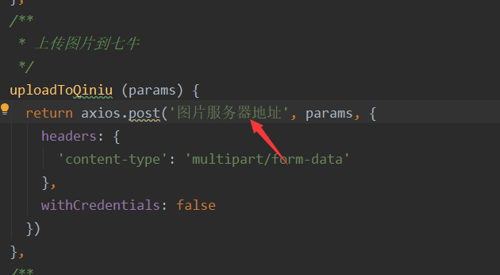

## 博客项目

这是一个基于Vue+Springboot+Springcloud的博客项目，实现了前后端分离。前端使用了[CB-ysx](https://github.com/CB-ysx/myblog/commits?author=CB-ysx)的客户界面和后台管理系统。后端使用了当前的Springboot项目。因为前端的接口并没有实现标准的REST风格，因此本项目中也只使用了GET和POST方法来实现所有功能。

**最新更新** ：由于七牛云图床在未绑定域名的情况下，一个月就会更换一次临时域名。所以近期将所有图床的图片存储到了服务器本地，实现永久保存。其中用到了FastDFS。

### 博客地址

[博客地址](http://47.100.40.16/home)

### 技术选型

#### 前端

- [X] vue
- [X] ElementUi

#### 后端

- [X] Springboot
- [X] Mybatis
- [X] SpringCloud


### 博客实现功能

#### 客户界面

- [X] 文章列表
- [X] 分类/标签列表（按列表搜索文章）
- [X] 文章按时间归档
- [X] “关于我”界面
- [X] 搜索功能
- [X] 评论
- [X] 文章详情页
- [ ] 友链

#### 后台管理页面

- [X] 登陆
- [X] 首页数据统计
- [X] 文章增删改查
- [X] 标签增删改查
- [X] 分类增删改查
- [X] 编辑“关于我”
- [X] 编辑博客配置页面
- [X] 评论管理

## 部署方法

### 部署方法

1.前往[前端代码](<https://github.com/midoii/myblog>)Clone代码

2.用WebStorm打开前端项目，修改`src/api/index.js`，该文件需要修改两处地方




在两处地方修改成自己服务器的地址或者域名，例如填写为`xx.xx.xx.xx:4677`

修改`common/upload/upCover.vue`，在第14行处，和前面一样修改域名，三者都可以填写同一个地址


3.在下面Terminal处输入`npm install -g vue-cli`，就会自动安装相关依赖（需要先安装node.js）

4.在Terminal输入`npm run build`，则会编译程序，生成可以运行的静态资源。结束后可以在项目根目录下看到dist文件夹

5.Clone当前项目，使用IDEA打开当前项目，根据软件提示导入Maven所提示的相关依赖

6.数据库配置文件在`blog-item/blog-item-service/src/main/resource/application.yaml`，修改数据库的数据库名，账号和密码。其中数据库表的结构文件在当前项目的根目录下，可以事先导入到Mysql中。


~~7.项目中图片都放在了七牛云上，使用前需要先注册一个七牛云账号。注意需要把对象存储空间的名字改成`blogimg`。在自己的七牛云上取得AK.SK以及空间域名，填入到以下位置中，该文件在`blog-item/blog-item-service/src/main/java/com/blog/item/controller/TokenController`中。~~


7.在服务器中安装FastDFS，安装教程和相关文件放在项目根目录的“FastDFS”文件夹中。

8.在`blog-item/blog-item-service/src/main/java/com/blog/item/controller/AdminController`取消注释注册的那部分代码，因为数据库中没有用户信息是无法登陆后台管理页面的。

9.在服务器中配置Nginx，以上面第二步中配置的4677端口为例子，下面是部分配置文件，这里直接使用Nginx实现了跨域访问，简单粗暴，配置完并启动


```conf
worker_processes  1;


events {
    worker_connections  1024;
}


http {
    include       mime.types;
    default_type  application/octet-stream;


    sendfile        on;

    keepalive_timeout  65;


	server {
        listen       80;
        server_name  服务器地址或者域名;
		root	dist文件夹位置;


		# 监听域名中带有group的，交给FastDFS模块处理
        location ~/group([0-9])/ {
            ngx_fastdfs_module;
        }
		
		location / {
            try_files	$uri $uri/ /index.html;
            index  index.html index.htm index.php;
        }
	}
	

	server {
		listen 4399;
		server_name 服务器地址或者域名;


		add_header Access-Control-Allow-Origin *;
		add_header Access-Control-Allow-Methods GET,POST,OPTIONS,PUT,DELETE;
		add_header Access-Control-Allow-Headers Content-Type,isdebug,isAdmin,accessToken,x-requested-with;
		add_header Access-Control-Allow-Credentials true;
		
		if ($request_method = 'OPTIONS') {
			return 200;
		}
		
		
		location / {
			index index.html index.htm index.php;
		}
		
		location /apex {
		
			proxy_pass http://127.0.0.1:10010;
			proxy_set_header Host $host:4677;
			proxy_set_header X-Real-IP $remote_addr;
			proxy_set_header X-Forwarded-For $proxy_add_x_forwarded_for;
			proxy_connect_timeout 600;
			proxy_read_timeout 600;
		}
		
		
		location /upload {
		
			proxy_pass http://127.0.0.1:10010;
			proxy_set_header Host $host:4677;
			proxy_set_header X-Real-IP $remote_addr;
			proxy_set_header X-Forwarded-For $proxy_add_x_forwarded_for;
			proxy_connect_timeout 600;
			proxy_read_timeout 600;
		}
	}
}

```

10.将前端项目之前生成的dist文件夹放在nginx配置中指定的root目录下，在IDEA中，可以在右侧栏调出Maven Project。在父工程中点击install按键，接下来会自动对每一个子工程进行打包，并生成jar包


在每一个子工程的target下都有生成的jar包，将它们放到服务器中，运行其中四个`blog-registry-1.0.0-SNAPSHOT.jar`、`blog-api-gateway-1.0.0-SNAPSHOT.jar`、`blog-item-service-1.0.0-SNAPSHOT.jar`、`blog-upload-1.0.0-SNAPSHOT.jar`

运行命令如下：

`nohup java -jar xxx.jar > systemxxx.log 2>&1 &`

其中前一个xxx代表每一个包名，后一个用来区分每一个进程所记录的日志名字

11.浏览器访问服务器域名或者地址就可以直接访问博客页面了，使用POSTMAN或者Insomnia等发包工具创建账户，如下图所示：


12.通过`服务器地址或者域名/admin`，并使用刚才创建的账号密码登陆到后台页面。


